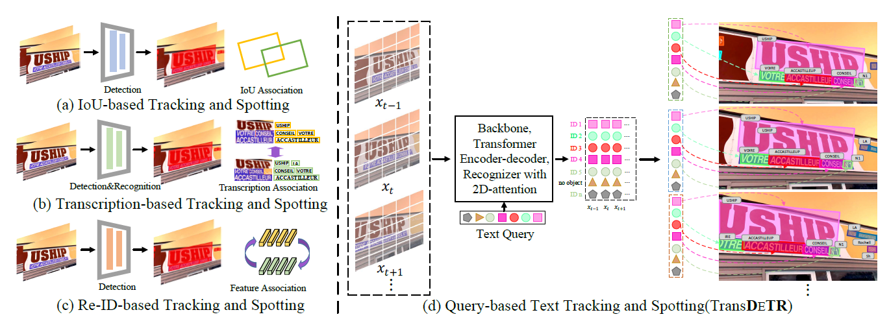

## TransDETR: End-to-end Video Text Spotting with Transformer

[](https://opensource.org/licenses/MIT)




## Introduction
[End-to-end Video Text Spotting with Transformer]

Link to our [MOVText: A Large-Scale, Multilingual Open World Dataset for Video Text Spotting](https://github.com/weijiawu/MOVText-Benchmark)


## Updates
- (08/04/2021) Refactoring the code.  

- (10/20/2021) The complete code has been released . 

## Performance

### [ICDAR2015(video) Tracking challenge](https://rrc.cvc.uab.es/?ch=3&com=evaluation&task=1)

Methods | MOTA | MOTP | IDF1 | Mostly Matched |	Partially Matched |	Mostly Lost
:---:|:---:|:---:|:---:|:---:|:---:|:---:
TransDETR | 47.5	|74.2	|65.5	|832	|484	|600

Models are also available in [Baidu Drive](https://pan.baidu.com/s/12U8ssJ_Fl4aaMtW1By4GPw) (password:4n03) or [Google Drive](https://drive.google.com/file/d/1r3J8Z5qwUv6sxV64FkSuU9XtGTfHrgxC/view?usp=sharing).

### [ICDAR2015(video) Video Text Spotting challenge](https://rrc.cvc.uab.es/?ch=3&com=evaluation&task=1)
Methods | MOTA | MOTP | IDF1 | Mostly Matched |	Partially Matched |	Mostly Lost
:---:|:---:|:---:|:---:|:---:|:---:|:---:
TransDETR | 55.7	|74.0	|69.3	|645	|334	|388

#### Notes
- The training time is on 8 NVIDIA V100 GPUs with batchsize 16.
- We use the models pre-trained on COCOTextV2.
- We do not release the recognition code due to the company's regulations.


## Demo
  


## Installation
The codebases are built on top of [Deformable DETR](https://github.com/fundamentalvision/Deformable-DETR) and [MOTR](https://github.com/megvii-model/MOTR).

* Linux, CUDA>=9.2, GCC>=5.4
  
* Python>=3.7

    We recommend you to use Anaconda to create a conda environment:
    ```bash
    conda create -n deformable_detr python=3.7 pip
    ```
    Then, activate the environment:
    ```bash
    conda activate deformable_detr
    ```
  
* PyTorch>=1.5.1, torchvision>=0.6.1 (following instructions [here](https://pytorch.org/))

    For example, if your CUDA version is 9.2, you could install pytorch and torchvision as following:
    ```bash
    conda install pytorch=1.5.1 torchvision=0.6.1 cudatoolkit=9.2 -c pytorch
    ```
  
* Other requirements
    ```bash
    pip install -r requirements.txt
    ```

* Build MultiScaleDeformableAttention
    ```bash
    cd ./models/ops
    sh ./make.sh
    ```
## Usage

### Dataset preparation

1. Please download [ICDAR2015](https://rrc.cvc.uab.es/?ch=3&com=evaluation&task=4) and [COCOTextV2 dataset](https://bgshih.github.io/cocotext/) and organize them like [FairMOT](https://github.com/ifzhang/FairMOT) as following:

```
.
├── COCOText
│   ├── images
│   └── labels_with_ids
├── ICDAR15
│   ├── images
│       ├── track
│           ├── train
│           ├── val
│   ├── labels
│       ├── track
│           ├── train
│           ├── val

```

2. You also can use the following script to generate txt file:


```bash 
cd tools/gen_labels
python3 gen_labels_COCOTextV2.py
python3 gen_labels_15.py
python3 gen_labels_YVT.py
cd ../../
```
### Training and Evaluation

#### Training on single node

You can download COCOTextV2 pretrained weights from Pretrained TransDETR[Baidu Drive](https://pan.baidu.com/s/1tlKL6GKExViZYt5bvX_J4w) (password:s93i) [Google Drive](https://pan.baidu.com/s/1tlKL6GKExViZYt5bvX_J4w). Or training by youself:
```bash 
sh configs/r50_TransDETR_pretrain.sh

```

Then training on ICDAR2015 with 8 GPUs as following:

```bash 
sh configs/r50_TransDETR_train.sh

```

#### Evaluation on ICDAR13 and ICDAR15

You can download the pretrained model of TransDETR (the link is in "Main Results" session), then run following command to evaluate it on ICDAR2015 dataset:

```bash 
sh configs/r50_TransDETR_eval.sh

```

#### Visualization 

For visual in demo video, you can enable 'vis=True' in eval.py like:
```bash 
--show

```

then run the script:
```bash 
python tools/vis.py

```


## License

TransDETR is released under MIT License.


## Citing

If you use TransDETR in your research or wish to refer to the baseline results published here, please use the following BibTeX entries:


